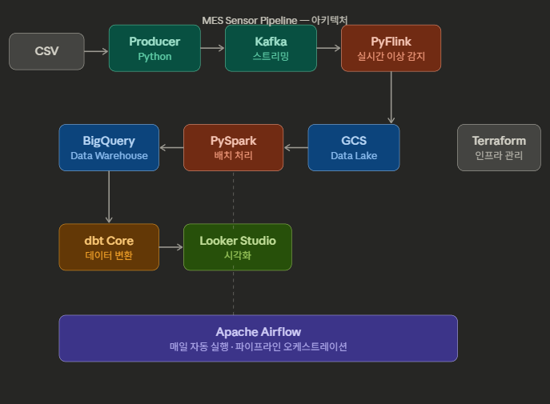

# 🏭 MES Sensor Pipeline

> 공장 펌프 센서 데이터 실시간 이상 탐지 파이프라인

[](https://python.org)
[](https://kafka.apache.org)
[](https://flink.apache.org)
[](https://spark.apache.org)
[](https://airflow.apache.org)
[](https://getdbt.com)
[](https://cloud.google.com)

---

## 📊 대시보드

👉 **[Looker Studio Dashboard 보기](https://lookerstudio.google.com/reporting/23885116-b67b-491b-ae6e-a83d658335e2)**

---

## 🏗️ 아키텍처



```
CSV
 └→ Python Producer
      └→ Apache Kafka
           └→ PyFlink (실시간 이상 감지 · BROKEN 경보)
                └→ GCS (Data Lake · Parquet)
                     └→ PySpark (배치 처리 · 날짜별 집계)
                          └→ BigQuery (Data Warehouse)
                               └→ dbt (staging → marts 변환)
                                    └→ Looker Studio (시각화)

스케줄링: Apache Airflow (@daily 자동 실행)
인프라:   Terraform (GCP 리소스 코드 관리)
```

---

## 🎯 프로젝트 배경 & 목적

MES(제조실행시스템) 개발 3년 경험을 바탕으로, **공장 설비 데이터를 실시간으로 감지하고 분석하는 엔드투엔드 파이프라인**을 구축했습니다.

---

## 💡 기술 선택 이유

| 기술 | 선택한 이유 |
|---|---|
| **Kafka** | 센서 데이터는 1분마다 발생하는 연속 스트림. 실시간 이상 감지를 위해 메시지 큐 필요 |
| **PyFlink** | Kafka Consumer로 BROKEN 발생 즉시 경보. Spark Streaming 대비 낮은 지연시간 |
| **PySpark** | 220만 건 배치 처리. Pandas는 단일 머신 한계, Spark는 분산 처리 가능 |
| **GCS (Data Lake)** | 원시 데이터를 저비용으로 저장. Parquet 포맷으로 Spark 읽기 최적화 |
| **BigQuery** | 서울 리전 지원, SQL 기반 분석에 최적화된 컬럼형 DWH |
| **Airflow** | 매일 자동 실행 스케줄링. Python 기반 DAG으로 복잡한 의존성 관리 가능 |
| **dbt** | BigQuery 안에서 SQL로 분석용 테이블 변환. Spark와 역할 분리로 관심사 분리 |
| **Terraform** | GCP 리소스를 코드로 관리. 재현 가능한 인프라, 협업 시 환경 일관성 보장 |

---

## 📁 데이터셋

- **출처:** [Pump Sensor Data (Kaggle)](https://www.kaggle.com/datasets/nphantawee/pump-sensor-data)
- **규모:** 220,320행 × 54컬럼 · 153일 · 1분 간격 · 2018-04-01 ~ 2018-08-31
- **핵심 컬럼:** sensor_00 ~ sensor_51, machine_status (NORMAL / BROKEN / RECOVERING)

| machine_status | 건수 | 비율 |
|---|---|---|
| NORMAL | 205,836 | 93.4% |
| RECOVERING | 14,477 | 6.6% |
| BROKEN | **7** | 0.003% |

---

## 🔍 EDA 핵심 발견
 
### 1. 잘못된 가설 수정
초기 가설은 RECOVERING → BROKEN 패턴 감지였으나, BROKEN 7건 전수 분석 결과 실제 순서는 **NORMAL → BROKEN → RECOVERING** 이었음. RECOVERING은 고장 전 징조가 아니라 복구 과정. EDA 없이 바로 코딩했다면 완전히 잘못된 Flink 로직을 만들었을 케이스.
 
### 2. BROKEN 발생 시점 센서 이상 징후 분석
BROKEN 발생 시점 전후 51개 센서를 전수 분석했으나, 샘플 수(7회) 부족과 평상시 센서 노이즈로 인해 사전 감지에 한계가 있음. 
더 많은 데이터가 축적되면 정밀한 이상 탐지 모델 개발이 가능할 것으로 판단.

---

## 🔥 핵심 문제 해결 경험

### 1. EDA로 잘못된 가설 수정 → Flink 로직 전면 재설계
처음엔 RECOVERING 감지 로직을 작성하려 했으나, EDA에서 BROKEN 7개를 전수 확인한 결과 패턴이 반대였음을 발견. **데이터를 먼저 보는 것이 왜 중요한지** 직접 경험한 케이스.

### 2. Airflow JAR 다운로드 2.7시간 → 2초
`spark.jars.packages` 방식은 컨테이너 환경에서 매번 Maven Central에서 JAR를 다운로드. conscrypt JAR 다운로드에 2.7시간 소요되어 Airflow Heartbeat 타임아웃(30분) 초과로 Task 강제 종료. 로컬 ivy 캐시 폴더를 Docker volumes로 마운트해 해결. 캐싱 전략의 중요성 체감.

### 3. GCS Parquet rename 실패 → FileOutputCommitter v2
Spark 기본 커밋 방식(v1)은 임시 파일 → rename 순서인데, GCS는 rename을 네이티브로 지원하지 않음. `fileoutputcommitter.algorithm.version=2`로 변경해 rename 없이 직접 최종 위치에 저장하는 방식으로 전환.

### 4. PySpark → BigQuery 직접 Write Scala 버전 충돌
PySpark 4.0은 Scala 2.13 기반이지만 spark-bigquery 커넥터는 Scala 2.12. GCS Parquet 경유 후 BigQuery Load Job 방식으로 전환. 막힌 방법을 고집하지 않고 더 안정적인 대안을 선택한 케이스.

---

## 📂 프로젝트 구조

```
mes-sensor-pipeline/
├── infra/
│   ├── terraform/          # GCP 리소스 (GCS 버킷, BigQuery 데이터셋)
│   └── docker/             # Docker Compose (Kafka, Airflow)
│       └── Dockerfile.airflow  # Java + PySpark 커스텀 이미지
├── pipeline/
│   ├── producer/           # Python Kafka Producer (CSV → Kafka 스트리밍)
│   ├── flink/              # PyFlink Consumer (실시간 BROKEN 감지 → 경보)
│   ├── spark/              # PySpark 배치 처리 (GCS → 집계 → BigQuery)
│   └── airflow/dags/       # Airflow DAG (@daily 자동 실행)
└── transform/
    └── sensor_pipeline/    # dbt 모델 (staging → marts)
        ├── models/staging/ # 원본 정제
        └── models/marts/   # 날짜별 집계 (Looker Studio 연동)
```

---

## ⚙️ 실행 방법

### 1. 환경 설정
```bash
git clone https://github.com/JaeHyun-Ahn98/mes-sensor-pipeline.git
cd mes-sensor-pipeline
python -m venv venv
venv\Scripts\activate  # Windows
pip install -r requirements.txt
```

### 2. GCP 인프라 생성
```bash
cd infra/terraform
terraform init
terraform apply
```

### 3. Kafka 실행
```bash
cd infra/docker
docker compose up -d zookeeper kafka
```

### 4. 스트리밍 파이프라인 실행
```bash
# Producer (CSV → Kafka)
python pipeline/producer/producer.py

# Flink Consumer (Kafka → 실시간 이상 감지)
python pipeline/flink/flink_consumer.py
```

### 5. Airflow 실행 (배치 자동화)
```bash
cd infra/docker
docker compose up airflow-init   # "User admin created" 확인 후 Ctrl+C
docker compose up -d
# localhost:8080 → sensor_pipeline DAG Trigger
```

### 6. dbt 변환
```bash
cd transform/sensor_pipeline
dbt run
```

---

## 🔧 기술 스택

| 구분 | 기술 |
|---|---|
| 스트리밍 | Apache Kafka, PyFlink |
| 배치 처리 | PySpark |
| 데이터 레이크 | Google Cloud Storage (Parquet) |
| 데이터 웨어하우스 | BigQuery |
| 데이터 변환 | dbt Core |
| 시각화 | Looker Studio |
| 오케스트레이션 | Apache Airflow |
| 인프라 | Terraform, Docker |
| 언어 | Python 3.10 |

---

## 🔍 주요 인사이트

- **BROKEN 패턴:** NORMAL → BROKEN → RECOVERING 순서. 고장 후 복구 패턴.
- **고장 발생:** 153일 중 7회 발생 (2018.04 ~ 2018.07)
- **데이터 수집:** 매일 1,440건 (1분 간격) 안정적으로 수집됨

---

## 👨‍💻 개발 환경

- **OS:** Windows 10 (WSL2)
- **Python:** 3.10.11
- **Docker Desktop:** 4.x
- **GCP:** Google Cloud Storage, BigQuery